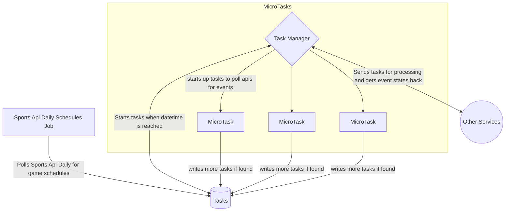

# otf-event-service
handles incoming and outgoing events

```mermaid
flowchart TD
    CronJob1[Sports Api Daily Schedules Job] --> |Polls Sports Api Daily for game schedules| TaskData[(Tasks)]
    TaskManager{Task Manager} <--> |Starts tasks when datetime is reached| TaskData
    TaskManager <--> |Sends tasks for processing and gets event states back| Services((Other Services))
    subgraph MicroTasks
    TaskManager --> |starts up tasks to poll apis for events| MicroTask1[MicroTask]
    TaskManager --> MicroTask2[MicroTask]
    TaskManager --> MicroTask3[MicroTask]
    end
    MicroTask1 --> |writes more tasks if found| TaskData
    MicroTask2 --> |writes more tasks if found| TaskData
    MicroTask3 --> |writes more tasks if found| TaskData
```