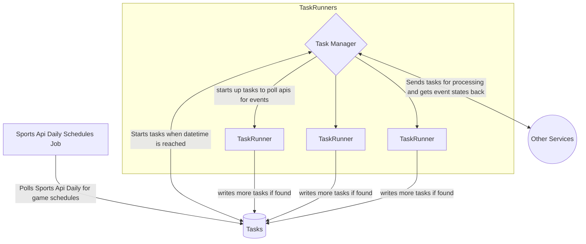

# otf-event-service

# Task Manager
## Overview

The __Task Manager__ effectively polls for scheduled tasks to be handled. Every task is scheduled by a
separate entity. It reads a timestream of scheduled tasks and when the datetime for a tasks has passed
and is in the ready state, the manager will start micro tasks. These __TaskRunners__ are essentially short lived
cron jobs (coroutines) that run every so often.

## Example
Say for example we want to keep track of the box score for a basketball game.
There is a daily cronjob that will check the game schedules for the day. It will send all the game schedules to
the database. The Task Manager will check the database every minute to see if any new tasks have been scheduled for
processing.

Once a game has started, the manager will find the task associated with that game and create a TaskRunner to keep
track of the boxscores as the game is live. The Task Manager will tell the TaskRunner to start a new coroutine with a TaskID and
enter the task as **Started** in the database.

The TaskRunner will then poll for the game information every 10 minutes until the game is over.

## TaskRunners
These TaskRunners are ran when the Task Manager finds a task in the database that is ready to run.
You can think of these as workers.
Once this process starts, the database adds a new row to make it known that the task has started.
This change in state allows the Task Manager to know not to try to run it again.
Each TaskRunner creates a cron job and they are timed to run periodically. This frees the Task Manager up for
scheduling purposes.

As each TaskRunner polls for information, it will create its own events. These events are what are sent out to
other services for processing. A TaskRunnerID and the main TaskID are both attached to these events.
The TaskRunnerID is for the TaskRunner that handles the events and the main TaskID is for every new event
sent out.

## How Orchestration works
The Task Manager is only responsible for checking scheduled tasks and creating TaskRunners.
There can be multiple instances of the manager running at once, but since it relies on a consistent
timestream data store there should never be duplicates of tasks running. However it may be best
to only run one of these managers at a time to avoid duplicate events.

A TaskRunner is created in the sense that a new subprocess should start spitting out new events to
outside services. However, the instances of TaskRunners are always running. They subscribe to a
queue and wait patiently for a message to come in from the Task Manager. When a message comes in,
it will create a coroutine for it and run it periodically. The TaskRunner will then end itself once
it has completed its mission.

The two services share the same databases. There are only two databases. One is for all task related
events that have occurred in the system. The other is for information related to how a task is structured.
Why two databases?

## POSTGRESQL database and Timestreams
### POSTGRESQL
We use a single postgresql database in conjunction with TimescaleDB. Most information other than the single Task table rarely change, and is
directly related to the structure of a task. Let us consider that for every task there will potentially be a task type
that is either defined by us, an event agent or the user.
For exmaple, if we want to keep track of period scores for a game, that will be its own task type. We can call it
'GAME_PERIOD_SCORE_TASK'. This task needs to be associated with the http url to poll and the number of seconds wed want
to poll this. Since this would be considered mutable, it doesn't fit the use case of a time stream. However, this data
will rarely change unless the polling needs to be increased or decreased. This Task can also be soft deleted.
This allows us to slowly structure how a task is made and processed.

### TIMESCALEDB
[TimescaleDB](https://docs.timescale.com/api/latest/)
The TimescaleDB table Task is only for tracking the state of tasks. A task can be in multiple states as it travels through all the
backend services. It could be in a **SCHEDULED** state when we schedule for it. It could be in a **STARTED** state as multiple
services work on the task. It could also either be in a **FINISHED** or **FAILED** state depending on the circumstances of
the processing. The Photo Service could fail, but the Caption service might succeed in creating a caption. All these states
must be considered as a task is worked on. If an outside service needs to update the state of a task, it will always go through
the Task Manager. TaskRunners only worry about making tasks. The Task Manager will track if a task is successful based on
the incoming progress of other services.

 

